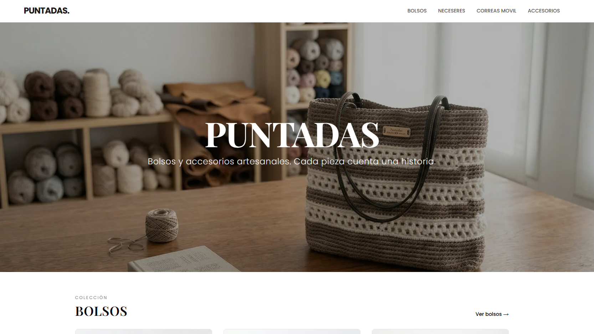
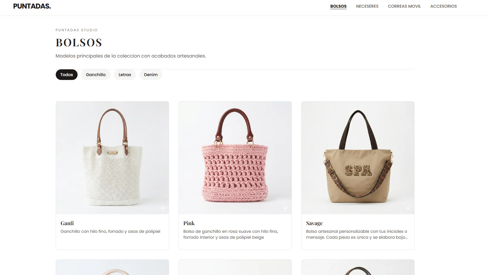

# Puntadas

Artisanal handbag e-commerce. A handcrafted digital experience built with Next.js, TypeScript, and Tailwind CSS.

---

## Visit the Website

### **[puntadasbcn.com](https://puntadasbcn.com)**

Discover our collection of handmade bags, unique designs, and artisanal craftsmanship.

---

## Screenshots

| | |
|---|---|
|  |  |

---

## Tech Stack

| Technology | Version | Purpose |
|---|---|---|
| [Next.js](https://nextjs.org/) | 15 (App Router) | Frontend framework |
| [React](https://react.dev/) | 19 | UI library |
| [TypeScript](https://www.typescriptlang.org/) | 5 | Static typing |
| [Tailwind CSS](https://tailwindcss.com/) | 3.4 | Styling |

## Project Structure

```
src/
├── app/                  # Routes and layouts (Next.js App Router)
│   ├── layout.tsx        # Root layout (Navbar, fonts, metadata)
│   ├── page.tsx          # Homepage
│   ├── catalogue/        # Category routes (/catalogue/[category])
│   ├── product/          # Product detail page (/product/[id])
│   └── [pages]/          # Info pages (contact, FAQs, policies...)
├── components/
│   ├── layout/           # Navbar, Footer (reusable)
│   ├── shop/             # Shop components (cards, galleries, filters)
│   └── ui/               # Base UI components (Button, Badge, Image...)
├── data/
│   └── products.ts       # Product catalog
├── types/
│   └── index.ts          # TypeScript interfaces
└── lib/
    ├── palette.ts        # Centralized color palette
    ├── constants.ts      # Global constants
    └── utils.ts          # Utility functions
```


## Authors

- **Alex Manzaneda** - [](https://github.com/alexmanzaneda)

- **Sara Vidal** - [](https://github.com/saravigon)


## License
© 2026 Puntadas. All rights reserved. 
This repository is published publicly for portfolio and demonstration purposes only. Copying, distributing, or adapting the code, design, or assets without explicit permission is strictly prohibited.
